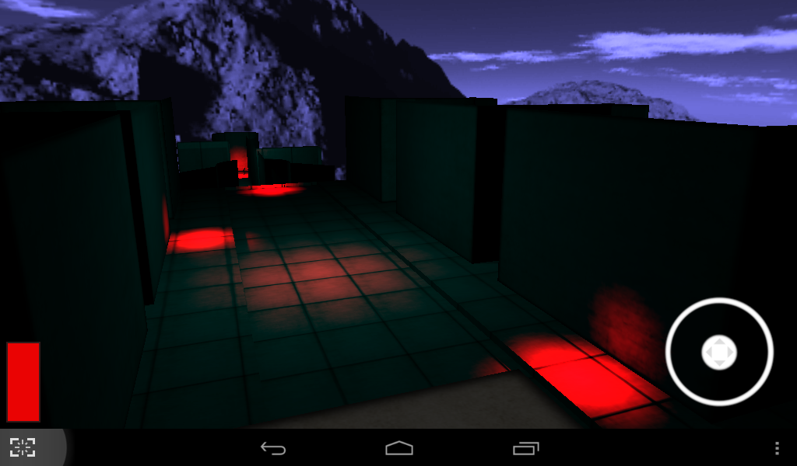
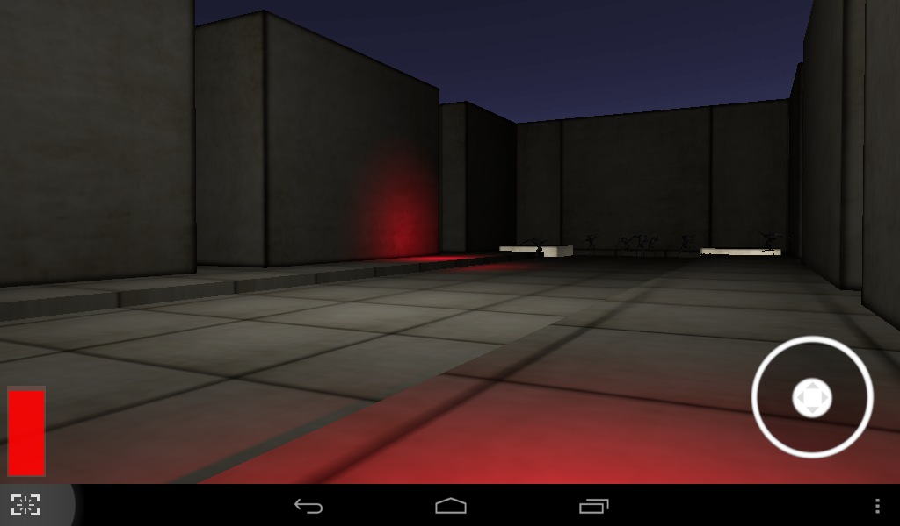
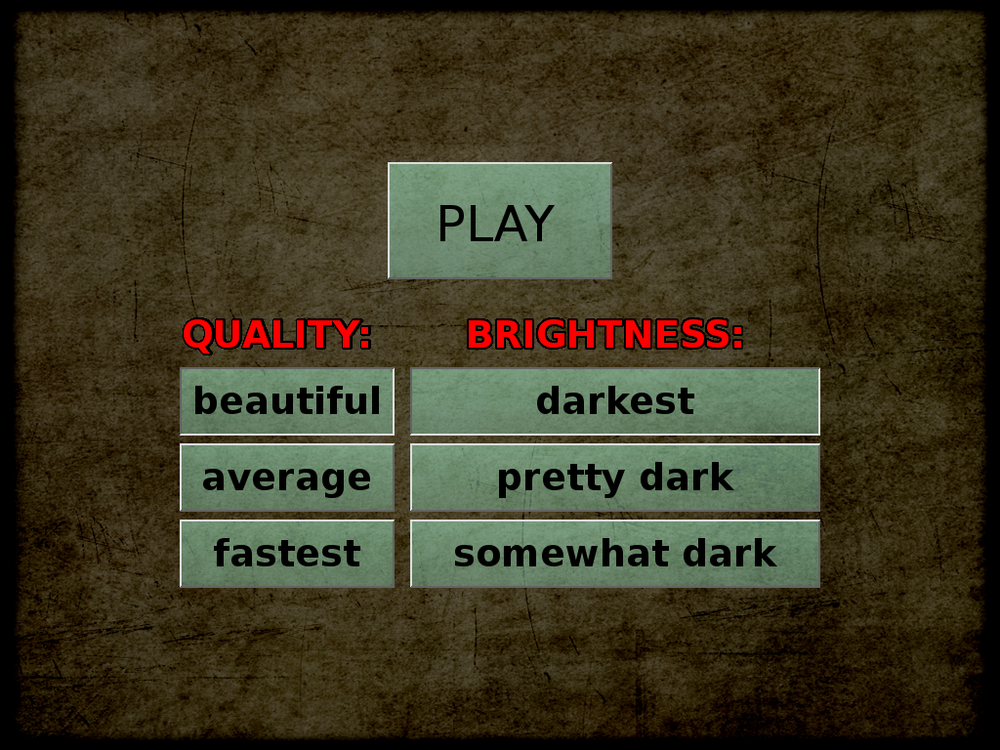

# Darkest Before the Dawn

A scary 3D game. You're only safe within the light.

Game information: https://castle-engine.io/darkest_before_dawn.php .

Using [Castle Game Engine](https://castle-engine.io/). This was the first game using Castle Game Engine for Android!

## License

Everything (code and data) is open-source, by Michalis Kamburelis, licensed on GNU GPL >= 2.0. Except some data files that are on various Creative Commons licenses (look for AUTHORS.txt inside data/).

## Screenshots

## Author

Michalis Kamburelis

## Building

Compile by:

- [CGE editor](https://castle-engine.io/editor). Just use menu items _"Compile"_ or _"Compile And Run"_.

- Or use [CGE command-line build tool](https://castle-engine.io/build_tool). Run `castle-engine compile` in this directory.

- Or use [Lazarus](https://www.lazarus-ide.org/). Open in Lazarus `darkest_before_dawn_standalone.lpi` file and compile / run from Lazarus. Make sure to first register [CGE Lazarus packages](https://castle-engine.io/lazarus).

- Or use [Delphi](https://www.embarcadero.com/products/Delphi). Open in Delphi `darkest_before_dawn_standalone.dproj` file and compile / run from Delphi. See [CGE and Delphi](https://castle-engine.io/delphi) documentation for details.
